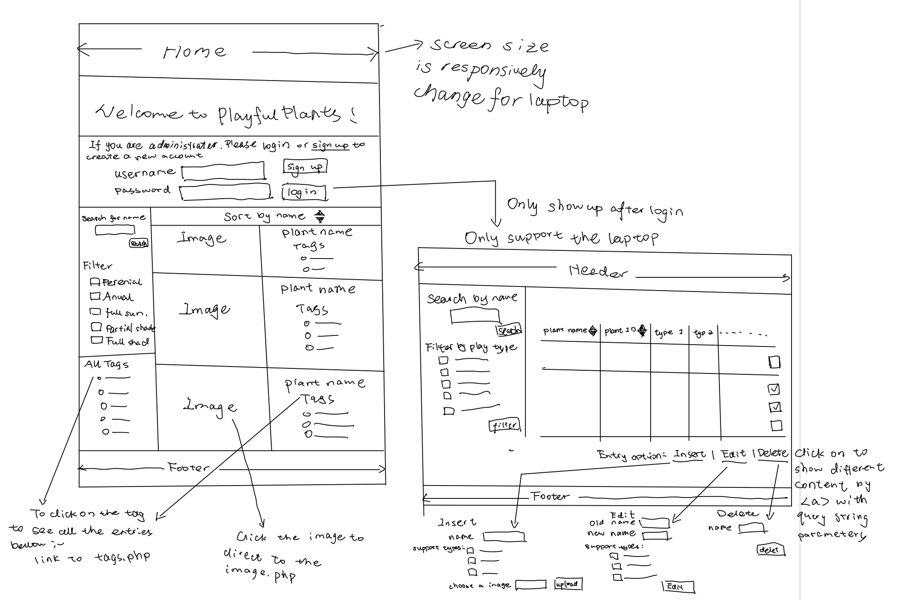

# Project 2: Design Journey

**For each milestone, complete only the sections that are labeled with that milestone.** Refine all sections before the final submission. If you later need to update your plan, **do not delete the original plan, leave it place and append your new plan below the original.** Explain why you are changing your plan. Remember you are graded on your design process. Updating the plan documents your process!

**Replace ALL _TODOs_ with your work.** (There should be no TODOs in the final submission.)

Be clear and concise in your writing. Bullets points are encouraged.

**Everything, including images, must be visible in Markdown Preview.** If it's not visible in Markdown Preview, then we won't grade it. We won't give you partial credit either. **Your design journey should be easy to read for the grader; in Markdown Preview the question _and_ answer should have a blank line between them.**


## Design / Plan (Milestone 1)

**Make the case for your decisions using concepts from class, as well as other design principles, theories, examples, and cases from outside of class (includes the design prerequisite for this course).**

You can use bullet points and lists, or full paragraphs, or a combo, whichever is appropriate. The writing should be solid draft quality.

### Audiences (Milestone 1)
> Who are your site's audiences?
> Briefly explain who the intended audiences are for your project website.
> **DO NOT INVENT RANDOM AUDIENCES HERE!** Use the audiences from the requirements.

_Consumer_: Parents with developing children

- This audiance will view, shop or browse the catalog's information

_Site Administrator_: members of Playful Plants project

- The administers of the site will edi entries, delete entries of the sites

### _Consumer_ Audience Goals (Milestone 1)

> Document your audience's goals.
> List each goal below. There is no specific number of goals required for this, but you need enough to do the job.
> **DO NOT INVENT RANDOM GOALS HERE OR STEREOTYPE HERE!** Your goals are things that your users want accomplish when using the site (e.g. print a list of plants). These are informed by the Playful Plants objectives. Review the assignment's requirements for details.

_Consumer_Goal 1: view and browse the playful plants


- **Design Ideas and Choices** _How will you meet those goals in your design?_
  - I will provide the users with the playful plants images as a media catalog. And I will provide the filter and sort function so that they can view and browse the plants easier.
- **Rationale & Additional Notes** _Justify your decisions; additional notes._
  - Images will help users better explore the plants that they interest and The users that interest in providing nature-rich places can get a staitforward information regarding the plants' looking.

_Consumer_ Goal 2: get the plants detailed information about gardening

- I will direct users to a detailed page of a plant when users click on the plant's image that they interest. This page will contain the information of the plant that users interest, including the hardiness zone, sun requirement etc.

- This detailed information about the plants that users interest in could help them make a decision of which plants to choose for their gardening projects. Because different plants fit different users' need.

_Consumer_ Goal 3: can easily find the specific information of plant by general type of the plants.

- I will provide the tags of each plant, and users can find the plants by the tags. And user click on the tags will direct them to a page contain all the entries bellow the tags

- The audience may know the type that they would like to know more. By adding tags, consumer audience could find the plants by types of plants.


### _Consumer_ Persona (Milestone 1)

> Use the goals you identified above to develop a persona of your site's audience.
> Create your persona using GenderMag's customizable personas.
> Take a screenshot and include it here. Persona must be visible in Markdown Preview; do not use PDF format!

- I choose Nancy for the persona, and she is an abi conginive style, and the detailed information about Nancy shows bellow


### _Administrator_ Audience Goals (Milestone 1)

> Document your audience's goals.
> List each goal below. There is no specific number of goals required for this, but you need enough to do the job.
> **DO NOT INVENT RANDOM GOALS HERE OR STEREOTYPE HERE!** Your goals are things that your users want accomplish when using the site (e.g. print a list of plants). These are informed by the Playful Plants objectives. Review the assignment's requirements for details.

_Administrator_ Goal 1: would like a database of playful plants and they can get the desired plant collections of play types

- **Design Ideas and Choices** _How will you meet those goals in your design?_
  - I might support this goal with a page with different play type that the plants supports and I might support this goal with funtionalize the database that Nancy can sort and filter/search all entries. And easily get the desired plant with a plant type.
- **Rationale & Additional Notes** _Justify your decisions; additional notes._
  - They can select the criteria of the plants, and filter and sort the plants data to percieve the desired plant information under the requirements they chose.

_Administrator_ Goal 2:  would like to support the consumer audience who will create gardens and maintain the information of plants

- I might support this goal with a catalog website backed by a SQL database (with plants data in it) and with the ability to insert new plants, edit or delete plants to the entries by including the HTML forms.

- By creating this catalog site, they could view the entire entries of plant information that provided in the database, and they can also administrate the plant data.

_Administrator_ Goal 3: Would like to share and save the catalog that they are interesting in.

- I might support this goal with the function to print the filter/sort result and make the table to be printable.

- With this function, the audience could print and save the results after they search/sort and edit the data and could also share with others and on other platforms.


### _Administrator_ Persona (Milestone 1)

> Use the goals you identified above to develop a persona of your site's audience.
> Create your persona using GenderMag's customizable personas.
> Take a screenshot and include it here. Persona must be visible in Markdown Preview; do not use PDF format!

- I choose Abby as the persona here, and the detailed information of Abby shows bellow:


### Site Design (Milestone 1)

> Document your _entire_ design process. **We want to see iteration!**
> **Show us the evolution of your design from your first idea (sketch) to the final design you plan to implement (sketch).**
> **Show us how you decided what data to display to each audience.**
> **Plan your URLs for the site.**
> **Provide a brief explanation _underneath_ each design artifact (2-3 sentences).** Explain what the artifact is, how it meets the goals of your personas (**refer to your personas by name**).
>
> **Important!** Plan _all_ site requirements. Don't forget login and logout.

_Initial Designs / Design Iterations:_

- Initially thought about develop the home page like this, Abby could edit the entries after she login, and the main page is media catalog. Nancy could click on the image to go for a detailed page and click tags for all the entries under the tags

- **The things that missing and not well considered are that: Nancy and Abby cannot see the different pages and data; Nancy couldn't search by the plants type/tags; too many buttons in when Nancy edit the entries; only considered the phone screen.**


_Final Design:_

- URL : / and /admin

- URL : /image

/URl : /tags


### Design Pattern Explanation/Reflection (Milestone 1)

> Write a one paragraph (6-8 sentences) reflection explaining how you used design patterns for media catalogs in your site's final design.

- I used the form of sortable/filterable lists or tables for Abby, The table could sort by name and filter by the play types. I only include table for Abby to use because Abby do not need image, she cares more about the play types supporting.
- I used the media catalogs that have a grid or tiled list of entries for Nancy to view. I also tagged the content to help users find what they’re looking for. I also supported filtering and sorting the items.


### Cognitive Styles Explanation/Reflection (Milestone 1)

> Write a one paragraph (6-8 sentences) reflection explaining how your final design supports the cognitive styles of each persona.

_Consumer Cognitive Styles Reflection:_

- Nancy has a Abi cognitive style. She keep focus on the tasks, so I designed the site to be simple that do not have many fancy things, so that Nancy could be comfortable with it. Nancy often have lower self confidence, so I designed the form to have more instructions, and give detailed feedback if something goes wrong. She also do not have much time to explore, so the information given is more straiforwards. Information Processing Style of Nancy is comprehensive, so there is only images and tags at the home page, only Nancy click the image she could open a detailed page.


_Site Administrator Cognitive Styles Reflection:_

Abby is process-oriented learning, I provide a detailed comment on the login to help her learning. Abby is also lower self confidence, so I avoid blame her rather give her instruction when form goes wrong. Abby also have little spared time, so I design the sites for her to be simple to use, no more fancy things to help her comfortable.


## Implementation Plan (Milestone 1, Milestone 2, Milestone 3, Final Submission)

### Database Schema (Milestone 1)
> Describe the structure of your database. You may use words or a picture. A bulleted list is probably the simplest way to do this. Make sure you include constraints for each field.
> **Hint: You probably need a table for "entries", `tags`, `"entry"_tags`** (stores relationship between entries and tags), and a `users` tables.
> **Hint: For foreign keys, use the singular name of the table + _id.** For example: `image_id` and `tag_id` for the `image_tags` (tags for each image) table.

Table: users

- Id:INTEGER NOT NULL UNIQUE PRIMARY KEY AUTOINCREMENT
- Username:TEXT NOT NULL UNIQUE
- Password:TEXT NOT NULL

Table: plants

- id: INTEGER{PRIMARY KEY, AUTO INCREMENT, NOT NULL, UNIQUE}
- plant_name: TEXT{UNIQUE, NOT NULL}
- plant_id: INTEGER, NOT NULL, UNIQUE
- Constructive Play: INTEGER{NOT NULL, 0 or 1}
- Exploratory Sensory Play: INTEGER{NOT NULL, 0 or 1}
- Physical Play: INTEGER{NOT NULL, 0 or 1}
- Imaginative Play: INTEGER{NOT NULL, 0 or 1}
- Restorative Play: INTEGER{NOT NULL, 0 or 1}
- Expressive Play: INTEGER{NOT NULL, 0 or 1}
- Play with Rules: INTEGER{NOT NULL, 0 or 1}
- Bio Play: INTEGER{NOT NULL, 0 or 1}

Table: Tags:

- Id:INTEGER NOT NULL UNIQUE PRIMARY KEY AUTOINCREMENT
- tag_name:TEXT NOT NULL

Table: tags-plants

- id:INTEGER NOT NULL UNIQUE PRIMARY KEY AUTOINCREMENT
- tags-id: INTEGER NOT NULL
- plants-id: INTEGER NOT NULL
FORENKEY tags-id REFERENCE (tags.id)
FORENKEY plants-id REFERENCE (plants.id)


### Database Query Plan (Milestone 1, Milestone 2, Milestone 3, Final Submission)

> Plan _all_ of your database queries. You may use natural language, pseudocode, or SQL.

```
1. All Records

- $result = exec_sql_query($db, 'SELECT * FROM plants;');
- $records = $result->fetchAll();


2. Filter/Sort Records

- Seperately set the sql select, where and order part of variable by default and an empty array
- Use conditional expression push the plant_play in the filter array
- Build the final query by put tegether the seperate part
- query the table with the built query
```


### Code Planning (Milestone 1, Milestone 2, Milestone 3, Final Submission)
> Plan any PHP code you'll need here using pseudocode.
> Tip: Break this up by pages. It makes it easier to plan.

1. home.php

```
include header.php
include footer.php

// display all the images records
$records = exec_sql_query( // query the database
  $db,
  "SELECT * FROM plants WHERE (id = :id)",
  array(
    ':id' => $id
  )
) ->fetchAll();


foreach($records as $record){
  // for each plants, show the image by id fields, if the image does not exit show the placeholder
  $path = $pathIma . $record['id'] . ".jpg";
  if(file_exits($path)){
    echo '<div style="text-align:center; float:left; clear:right;">';
        echo '<a href="/image?id=$record['id']"> </a>';
        echo '<p>'.$record['plant_name'].'</p>';
    echo '</div>';
  } else{
    echo '<div style="text-align:center; float:left; clear:right;">';
        echo '<a href="/image?id=$record['id']"></a>';
        echo '<p>'.$record['plant_name'].'</p>';
    echo '</div>';
  }
}

// query the detailed page
   $id = $_GET['id']; //get the parameter
   $name= SELECT * FROM plants WHERE(id=$id);
   $plant_name = $name['plants_name'];

  $records = exec_sql_query(  //locate the item
    $db,
    "SELECT tags.tag_name AS 'tags.tag_name'

    FROM tags INNER JOIN plants-tags
    WHERE (plants_tags.plant_id = :id);",
    array(
      ':id' => $id
    )
  )->fetchAll();


$sql_select_part = 'SELECT * FROM plants';
$sql_where_part = '';
$sql_order_part = '';

$sql_search_expression = NULL;
$sql_filter_expression = NULL;
$sql_filter_expressions = array();
$sql_filter_expressions = array();

--- search ---
$search_terms = trim($_GET['search'] ?? NULL);

if (empty($search_terms)) {
  // If empty string, set to NULL
  $search_terms = NULL;
}
$sticky_search = $search_terms; // sticky

if ($search_terms) {
  // conditional SQL expression for WHERE clause
  array_push($sql_search_expressions, "(plant_name like '%' || :search || '%')");
  $sql_param_markers[':search'] = $search_terms; // untrusted
}


--- filter ---
$filter_annual = (bool)($_GET['annual'] ?? NULL); // untrusted
$filter_perennial = (bool)($_GET['perennial'] ?? NULL); // untrusted
$filter_fullsun = (bool)($_GET['fullsun'] ?? NULL); // untrusted
$filter_partialshade = (bool)($_GET['partialshade'] ?? NULL); // untrusted
$filter_fullshade = (bool)($_GET['fullshade'] ?? NULL); // untrusted

$sticky_filter_annual = (filter_annual ? 'checked' : '');
$sticky_filter_perennial = (filter_perennial ? 'checked' : '');
$sticky_filter_fullsun = (filter_fullsun ? 'checked' : '');
$sticky_filter_partialshade = ($filter_partialshade ? 'checked' : '');
$sticky_filter_fullshade = ($filter_fullshade ? 'checked' : '');

if ($filter_annual) {
  array_push($sql_filter_expressions, "(annual = 1)");
}

if ($filter_perennial) {
  array_push($sql_filter_expressions, "(perennial = 1)");
}

if ($filter_fullsun) {
  array_push($sql_filter_expressions, "(fullsun = 1)");
}

if ($filter_partialshade) {
  array_push($sql_filter_expressions, "(partialshade= 1)");
}

if ($filter_fullshade) {
  array_push($sql_filter_expressions, "(fullshade = 1)");
}

if (count($sql_filter_expressions) > 0) {
  $sql_filter_expression = '(' . implode(' OR ', $sql_filter_expressions) . ')';
}

if ($sql_search_expression && $sql_filter_expression) {
  $sql_where_part = ' WHERE ' . $sql_search_expression . ' AND ' . $sql_filter_expression;
} else if ($sql_search_expression && !$sql_filter_expression) {
  $sql_where_part = ' WHERE ' . $sql_search_expression;
} else if (!$sql_search_expression && $sql_filter_expression) {
  $sql_where_part = ' WHERE ' . $sql_filter_expression;
}


--- sort ---
$sort = $_GET['sort'] ?? NULL;
$order = $_GET['order'] ?? NULL;


$order_next_url = 'asc';


if ($order == 'asc') {
  // ascending
  $order_sql = 'ASC';
  $order_next = 'desc';

  $filter_icon = 'up';
} else if ($order == 'desc') {
  // descending
  $order_sql = 'DESC';
  $order_next = NULL;

  $filter_icon = 'down';
} else {
  $order = NULL;
}

$sql_order_part = ' ORDER BY plant_name ' . $order_sql;

$order_next_url[$sort] = $order_next;

$sort_url = '/administrator?';

// final query
$sql_query = $sql_select_part . $sql_where_part . $sql_order_part . ';';

// query plants table with built query
$records = exec_sql_query($db, $sql_query, $sql_param_markers)->fetchAll();

--- query strings for detailed pages


// display the name under the image

foreach ($records as $record){
  <?php echo htmlspecialchars($record["plants_name"]); ?>
} // echo the tags of the image one by one by a loop


// filter and sticky image records
$sql_select_part = 'SELECT * FROM images';
$sql_where_part = '';
$sql_order_part = ' ORDER BY plant_name;';

if(isset($_POST['submit'])){
  $form_valid = true;
  $filter = (bool)($_POST['value1'] ?? NULL);
  ...

  if(empty){
    $form_valid = false;
    $feedback ='';
  }

  if(form_valid){
    $sticky_filter= ($value1 ? "checked" : '' );
    ...
  } // set the filter sticky
}


// sort image records

$query_string = http_build_query(array('sort' => 'plant_name'), 'order' => 'asc');

<a href = '/?<?php echo $query_string' img = '/URL'>


// show up the administrator page

```

2. administrator.php(same as project2)
```

// display all records (same as project2)
// search/filter records and sticky(same as project2)

--- insert entries ---
// insert without tags

define("MAX_FILE_SIZE", 1000000);

$file_feedback_class = 'hidden';
$name_feedback_class = 'hidden';
$id_feedback_class = 'hidden';
$play_feedback_class = 'hidden';
$tag_feedback_class = 'hidden';


$upload_file = NULL;
$upload_name = NULL;
$upload_id = NULL;
$upload_ext = NULL;
$upload_play = NULL;
$upload_tag = NULL;


$sticky_name = '';
$sticky_id = '';
$sticky_play = '';
$sticky_tag = '';


if (isset($_POST["upload"])) {

  $upload_name = trim($_POST['plant_name']);
  $upload_id = trim($_POST['plant_id']);
  $upload_play = trim($_POST['play']);

  $garden1 = $_POST['add_garden1'];
  $garden2 = $_POST['add_garden2'];
  $garden3 = $_POST['add_garden3'];
  $garden4 = $_POST['add_garden4'];
  $garden5 = $_POST['add_garden5'];


  $tag = $_POST['tag'];


  $sticky_tag1 = '';
  $sticky_tag2 = '';
  $sticky_tag3 = '';
  $sticky_tag4 = '';
  $sticky_tag5 = '';
  $sticky_tag6 = '';
  $sticky_tag7 = '';
  $sticky_tag8 = '';
  $sticky_tag9 = '';


  $sticky_garden1 = '';
  $sticky_garden2 = '';
  $sticky_garden3 = '';
  $sticky_garden4 = '';
  $sticky_garden5 = '';


  $garden1 = empty($garden1) ? 0 : 1;
  $garden2 = empty($garden2) ? 0 : 1;
  $garden3 = empty($garden3) ? 0 : 1;
  $garden4 = empty($garden4) ? 0 : 1;
  $garden5 = empty($garden5) ? 0 : 1;


  $upload = $_FILES['file'];

  $form_valid = True;

  if ($upload['error'] == UPLOAD_ERR_OK)

    $upload_filename = basename($upload['name']);

    $upload_ext = strtolower(pathinfo($upload_filename, PATHINFO_EXTENSION));

    // This site only accepts jpg, jpeg, png files!
    if (!in_array($upload_ext, array('jpg','jpeg','png'))) {
      $form_valid = False;
    }
  } else {
    // upload was not successful
    $form_valid = False;
  }


  if (empty($upload_name)) {
    $form_valid = False;
    $name_feedback_class = 'hidden';
  }


  if (empty($upload_id)) {
    $form_valid = False;
    $id_feedback_class = '';
  }

  if (empty($upload_play)) {
    $form_valid = False;
    $play_feedback_class = '';
  }

  if ($form_valid) {

    // insert upload into DB
    $result = exec_sql_query(
      $db,
      "INSERT INTO plants (plant_name, plant_id, Constructive_play, Exploratory_Sensory_Play, Physical_Play, Imaginative_Play, Restorative_Play, Expressive_Play, Play_Rules, Bio_Play, Perennial, Annual, Full_sun, Partial_shade, Full_shade, file_ext) VALUES (:name, :plant_id, :play1, :play2, :play3, :play4, :play5, :play6, :play7, :play8, :garden1, :garden2, :garden3, :garden4, :garden5, :file_ext)",
      array(
        ':name' => $upload_name,
        ':plant_id' => $upload_id,
        ':play1' => $play1,
        ':play2' => $play2,
        ':play3' => $play3,
        ':play4' => $play4,
        ':play5' => $play5,
        ':play6' => $play6,
        ':play7' => $play7,
        ':play8' => $play8,
        ':garden1' => $garden1,
        ':garden2' => $garden2,
        ':garden3' => $garden3,
        ':garden4' => $garden4,
        ':garden5' => $garden5,
        ':file_ext' => $upload_ext,
      )
    );

    $record_id = $db->lastInsertId('id');

    // insert tags for an exiting plant
    $insert_name_feedback = 'hidden';
    $insert_tag_feedback= 'hidden';
    $insert_sucess = 'hidden';


    $insert_name = trim($_POST['insert_name']);
    $insert_tag = trim($_POST['insert_tag']);

    $insert_id = exec_sql_query(  //locate the item
    $db,
    "SELECT *
    FROM plants
    WHERE (plants.plant_name = :name);",
    array(
      ':name' => $insert_name
    )
    )->fetchAll();
    if(empty($insert_tag)){
      $insert_name_feedback = '';
    }else{
      $name_id = insert_id['id'];

    $tag_id = exec_sql_query(  //locate the item
    $db,
    "SELECT *
    FROM tags
    WHERE (tags.tag_name = :name);",
    array(
      ':name' => $insert_tag
    )
  )->fetchAll();

    if(empty($tag_id)){
      $insert_tag_feedback= '';
    }else{
      $tag_id = insert_id['id'];
    }

    $result = exec_sql_query(
      $db,
      "INSERT INTO tags_plants (plants_id, tags_id) VALUES (:name_id, :tag_id)",
      array(
        ':name_id' => $name_id,
        ':plant_id' => $tag_id
      )
    );

    if($result){
      $insert_sucess = '';
    }


```

3. edit.php

```
--- edit entries ---

$edit_name_feedback = 'hidden';
$edit_play_feedback = 'hidden';

$sticky_name = '';
$sticky_constructive = '';
$sticky_sensory = '';
$sticky_physical = '';
$sticky_imaginative = '';
$sticky_restorative = '';
$sticky_expressive = '';
$sticky_rules = '';
$sticky_bio = '';

$plant_id = $_GET['plant'] ?? NULL;
$update_id = $_POST['update-id'] ?? NULL; // untrusted

if($update_id){
  $records = exec_sql_query(
    $db,
    "SELECT * FROM plants WHERE (id = :id);",
    array(
      ':id' => $update_id
    )
  )->fetchAll();

  if (count($records) > 0) {
    $record = $records[0]; // first record
  }


  $add_name = $_GET['add_name'];
  $add_play1 = $_GET['add_play1'];
  $add_play2 = $_GET['add_play2'];
  $add_play3 = $_GET['add_play3'];
  $add_play4 = $_GET['add_play4'];
  $add_play5 = $_GET['add_play5'];
  $add_play6 = $_GET['add_play6'];
  $add_play7 = $_GET['add_play7'];
  $add_play8 = $_GET['add_play8'];

  $add_form_valid = true;

  if(empty($add_name)){
    $add_form_valid = false;
    $add_name_feedback='';
  }

  if(empty($add_play1)&&empty($add_play2)&&empty($add_play3)&&empty($add_play4)&&empty($add_play5)&&empty($add_play6)&&empty($add_play7)&&empty($add_play8)){

    $add_form_valid = false;
    $add_play_feedback = '';
  }

  if($add_form_valid){
    // fiter the result according to the play types
    $show_confirmation = True;
    $add_play1 = empty($add_play1) ? 0 : 1;
    $add_play2 = empty($add_play2) ? 0 : 1;
    $add_play3 = empty($add_play3) ? 0 : 1;
    $add_play4 = empty($add_play4) ? 0 : 1;
    $add_play5 = empty($add_play5) ? 0 : 1;
    $add_play6 = empty($add_play6) ? 0 : 1;
    $add_play7 = empty($add_play7) ? 0 : 1;
    $add_play8 = empty($add_play8) ? 0 : 1;


```

4. image.php

```

// display the image that user clicked on and its detailed information
$plant_id = $_GET['id'] ?? NULL;

// JIONT query to get the plant and all the tags about this image
if ($plant_id) {
  $records = exec_sql_query(
    $db,
    "SELECT
    tag.tag_name AS "tag.tag_name",
    plants.plant_name AS "plants.plant_name",
    plants.perennial AS "plants.perennial",
    plants.annual AS "plants.annual",
    plants.full_sun AS "plants.full_sun",
    plants.hardiness_zone AS "plants.hardiness_zone"
    FROM tags
    INNER JOIN tags_plants ON (tags.id = tags_plants.tags.id)
    INNER JOIN plants ON (plant.id = tags_plants.plant.id)
    WHERE
    (tags_plants.plants_id= :id);",
    array(':id' => $plant_id)
  )->fetchAll();

  if (count($records) > 0) {
    $plant = $records[0];

    $page_title = $plant['plant_name'] . ' - information';
  } else {
    $plant = NULL;

    $page_title = 'Unknown plant - information';
  }
}


// show the specific image and its tags
" alt="<?php echo htmlspecialchars($plant['plant_name']); ?>" />

// show the detailed information about the image

$perennial = $plant[perennial] == 1 ? 'YES' : 'NO';
$annual = $plant['annual'] == 1 ? 'YES' : 'NO';
$fullsun = $plant['fullsun'] == 1 ? 'YES' : 'NO';
$fullshade = $plant['fullshade'] == 1 ? 'YES' : 'NO';
$partialshade= $plant['partialshade'] == 1 ? 'YES' : 'NO';

  <td>Plant Name: <?php echo htmlspecialchars($plant['plant_name']); ?> <br>
  Tags: <?php foreach ($plant) { <?php echo htmlspecialchars($plant['tag_name']); ?>  <?php } ?> <br>
  Perennial : <?php echo htmlspecialchars($perennial]); ?> <br>
  Annual : <?php echo htmlspecialchars($annual); ?> <br>
  Full Sun :<?php echo htmlspecialchars($fullsun); ?> <br>
  Partial Shade :<?php echo htmlspecialchars($partialshade); ?> <br>
  Full Shade :<?php echo htmlspecialchars($fullshade); ?> <br>
  Hardiness Zone Range: <?php echo htmlspecialchars($plant['hardiness_zone']); ?> </td>


```

5. tags.php

```
// display the images that under the tags
 <a href="/tags?<?php echo http_build_query(array('tags_id' => $record['tags_id'])); ?>"> // each tags have a link to the tags page

$tag_id = $_GET['tag_id'] ?? NULL;

// query the images with this tag;
if ($document_id) {
  $records = exec_sql_query(
    $db,
    "SELECT
    tag.tag_name AS "tag.tag_name",
    plants.plant_name AS "plants.plant_name",
    plants.perennial AS "plants.perennial",
    plants.annual AS "plants.annual",
    plants.full_sun AS "plants.full_sun",
    plants.hardiness_zone AS "plants.hardiness_zone"
    FROM tags
    INNER JOIN tags_plants ON (tags.id = tags_plants.tags.id)
    INNER JOIN plants ON (plant.id = tags_plants.plant.id)
    WHERE
    (tags_plants.tags_id= :id);",
    array(':id' => $tags_id)
  )->fetchAll();

  if (count($records) > 0) {
    $tags = $records[0]
    $page_title = $tags['tags_name'] . ' - information';
  } else {
    $plant = NULL;

    $page_title = 'Unknown tag - information';
  }
}

// show the images under this tag and show their tags info
foreach($records as $record){
  // for each plants, show the image by id fields, if the image does not exit show the placeholder
  $path = "public/uploads/image/" . $record['id'].".jpg";

  echo '<div class= "image" style="text-align:center; float:left; clear:right;">';
      echo '<a href="/image?id='.$record['id'].'"> </a>';
      echo '<p>'.$record['plant_name'].'</p>';
  echo '</div>';

}


```


### Accessibility Audit (Final Submission)
> Tell us what issues you discovered during your accessibility audit.
> What do you do to improve the accessibility of your site?

- The image scr should have a corresponding "alt", just forgot to add it.
- The contrast error, I change the background color of the filter form


## Reflection (Final Submission)

### Audience (Final Submission)

> Tell us how your final site meets the goals of your audiences. Be specific here. Tell us how you tailored your design, content, etc. to make your website usable for your personas.

1. For consumers, I have the view all images of plants on home page, and they can have a overview of all plants. And they can filter/sort/search the entries by gardening information of plants to locate the plant that they want.

2. They also can see the detailed page for the plant by click on the plant, they can get the detailed informaiton about the gardening with the plant, that will help their decision

3. I tagged all the plant and showed the tags on the home page, they could click on the tag to see all the plants have this tag, so that they can find the plant easily.

4. For administrator, I have a page with different play type that the plants supports and I funtionalized the database that they can sort and filter/search all entries to get the play type that they want for a plant

5. They could insert the entries(including upload files/ play type/ gardening infos) to maintain the whole website and database.

6. They could print the site in a good form.


### Additional Design Justifications (Final Submission)

> If you feel like you haven’t fully explained your design choices in the final submission, or you want to explain some functions in your site (e.g., if you feel like you make a special design choice which might not meet the final requirement), you can use the additional design justifications to justify your design choices. Remember, this is place for you to justify your design choices which you haven’t covered in the design journey. You don’t need to fill out this section if you think all design choices have been well explained in the design journey.

- I did not have the function for edit tags, but have the function for insert tags. I did this because administrator need insert tags for a newly added entries, edit tags cannot satisfy this need. By having the add new tags function, one can insert new tags or exist tags for a plant/new plant, and they could also finish "edit" tags by some other ways.


### Self-Reflection (Final Submission)
> Reflect on what you learned during this assignment. How have you improved from Project 2? What would you do differently next time?

- I heavily practiced the SQL query for the database including select, insert into, delete, etc.
- I learned a lot about how to use php conditional sentences to do the formvalidation, provide feedbacks etc.
- I learned lot about how sessions and cookies relations and how to do user control with these.


> Take some time here to reflect on how much you've learned since you started this class. It's often easy to ignore our own progress. Take a moment and think about your accomplishments in this class. Hopefully you'll recognize that you've accomplished a lot and that you should be very proud of those accomplishments!

- Before seriouly, I coding very little and no nothing about php and sql, in this class, I learned a lot the usefullness of this tow tools can make the website better react to users and make the site dynamic!

- I could develop a dynamic site by myself and learned to use forms for filter/search/insert/delete etc, and learned how to use this forms along with php to maintain the data in the database

- Really challenging this term, but really learned a lot.


### Grading: Step-by-Step Instructions (Final Submission)
> Write step-by-step instructions for the graders.
> The project if very hard to grade if we don't understand how your site works.
> For example, you must login before you can delete.
> For each set of instructions, assume the grader is starting from

_View all entries:_

1. The home page have view all images by grid for consumers
2. After administrator login via the the form on upper-left corner (username:menglin), they will the the all entries for plant with different play type supporting

_View all entries for a tag:_

1. On down-left corner all all the tags, click the tag name to see all the entries for the tag

_View a single entry's details:_

1. just click on the image

_How to insert and upload a new entry:_

1. You should login to the administrator page, and at the bottom of the page there is a "Add a plant" that you can upload new image and new plant select their play type/ gardening information. click add item to add

_How to delete an entry:_

1. Click on the edit button on the last colomn of the table of the entry that you want to delete, at there you could choose to edit that item by clicking on "edit item" or click "delete item " to delete the entry

_How to edit and existing entry and its tags:_

1. Click on the edit button on the last colomn of the table of the entry
2. The site could not edit tags, but can insert tags for a plant. It is on the left of the insert form. One could add tags for the newly added or exist entry, if the tags does not exist in the database, add new tags, if it already have for the plant, show inforamtion to the user that the tag have already exist for the plant.
